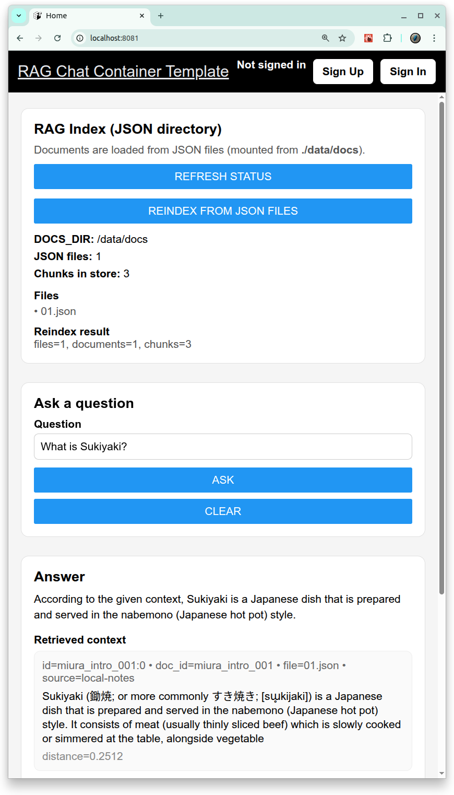

# [RAG Chat Container Template](https://github.com/europanite/rag_chat_container_template "RAG Chat Container Template")

[](https://github.com/europanite/rag_container_template/actions/workflows/ci.yml)
[](https://github.com/europanite/rag_container_template/actions/workflows/lint.yml)
[](https://github.com/europanite/rag_container_template/actions/workflows/codeql.yml)
[](https://github.com/europanite/rag_container_template/actions/workflows/pages/pages-build-deployment)



A Docker Compose template for a simple **RAG (Retrieval-Augmented Generation)** app:

- **Backend**: FastAPI
- **Frontend**: Expo / React Native
- **DB**: PostgreSQL (auth/users)
- **Vector store**: ChromaDB
- **LLM / Embeddings**: Ollama

---

## What changed in this version

✅ **No document input form.**  
Instead, the backend builds the vector DB from **JSON files stored in a directory** (mounted into the backend container).

You can:

- Auto-index at container startup (`RAG_AUTO_INDEX=true`)
- Manually rebuild the index from the UI (calls `POST /rag/reindex`)
- Check indexing status (calls `GET /rag/status`)

---

## JSON document format

Place JSON files under:

- Host: `./data/docs/*.json`
- Container: `${DOCS_DIR}` (default: `/data/docs`)

Each JSON file can be a single object or a list of objects:

```json
[
  {
    "id": "miura_intro_001",
    "text": "三浦半島は神奈川県にあります。海がきれいです。山もあります。",
    "source": "local-notes",
    "metadata": { "lang": "ja", "tags": ["miura"] }
  }
]
```

Notes:

- `id` must be unique across all documents.
- Chunks are stored with deterministic IDs: `"{id}:{chunk_index}"`.

---

## Features

- **Backend**
  - FastAPI

- **Frontend**
  - Expo / React-Native

- **DataBase**
  - PostgreSQL

- **RAG (Retrieval-Augmented Generation)**
  - **Embeddings** with Ollama
  - **Vector store** with ChromaDB
  - **Chat / Answer generation** 

- **DevOps**
  - **Docker Compose**
  - GitHub Actions workflows

---

## Architecture


---

## 🚀 Getting Started

### 1. Prerequisites
- [Docker Compose](https://docs.docker.com/compose/)
- [Expo Go](https://expo.dev/go)

### 2. Build and start all services:

Edit `.env` if you want to change models or indexing behavior.

### 3) Build and start

```bash
# set environment variables:
export REACT_NATIVE_PACKAGER_HOSTNAME=192.168.3.6

docker compose build

# Run the container
docker compose up
```
---

### 4) Open the app

- Frontend: Expo dev server logs will show the QR code / URL.
- Backend API: `http://localhost:8000/health`

---

### 3. Test:

```bash
# Backend pytest
docker compose \
  -f docker-compose.test.yml run \
  --rm \
  --entrypoint /bin/sh backend_test \
  -lc 'pytest -q'

# Backend Lint
docker compose \
  -f docker-compose.test.yml run \
  --rm \
  --entrypoint /bin/sh backend_test \
  -lc 'ruff check /app /tests'

# Frontend Test
docker compose \
  -f docker-compose.test.yml run \
  --rm frontend_test
```

## Visit the services:

- Backend API: http://localhost:8000/docs


- Frontend UI (WEB): http://localhost:8081
- Frontend UI (mobile): exp://${YOUR_HOST}:8081: access it with the QR provided by Expo.


---

## RAG API

### Ingest documents

#### POST /rag/ingest

```bash
curl -X POST http://localhost:8000/rag/ingest \
  -H "Content-Type: application/json" \
  -d '{
    "documents": [
      {
        "id": "miura_intro_001",
        "text": "Miura Peninsula is located in Kanagawa, south of Yokohama. It is famous for its coastline, fresh seafood, and views of Mount Fuji on clear days.",
        "source": "local-notes"
      }
    ]
  }'
```

#### Response:
```bash
{
  "total_chunks": 1
}
```

### Ask a question

#### POST /rag/query

```bash
curl -X POST http://localhost:8000/rag/query \
  -H "Content-Type: application/json" \
  -d '{
    "question": "Where is the Miura Peninsula and what is it famous for?",
    "top_k": 5
  }'
```

#### Example response:

```bash
{
  "answer": "The Miura Peninsula is in Kanagawa, south of Yokohama. It is known for its coastline, fresh seafood, and views of Mount Fuji on clear days.",
  "chunks": [
    {
      "id": "miura_intro_001_0",
      "text": "...",
      "source": "local-notes",
      "chunk_index": 0,
      "distance": 0.01
    }
  ]
}
```

## Useful endpoints

- `GET /rag/status` – docs dir + JSON file count + chunks in store
- `POST /rag/reindex` – clear and rebuild Chroma from `DOCS_DIR`
- `POST /rag/query` – ask a question (returns answer + retrieved context)

---

# License
- Apache License 2.0